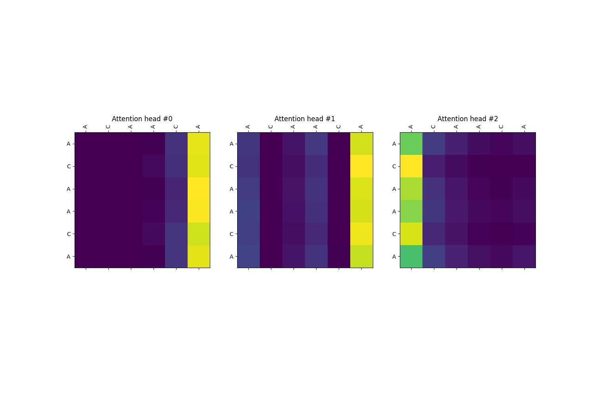
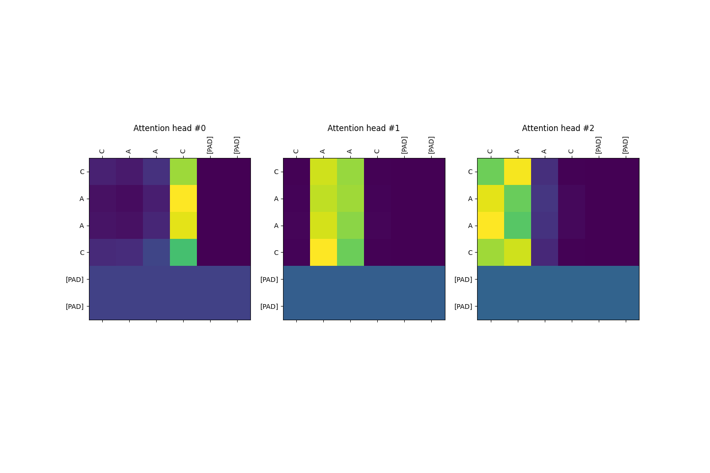
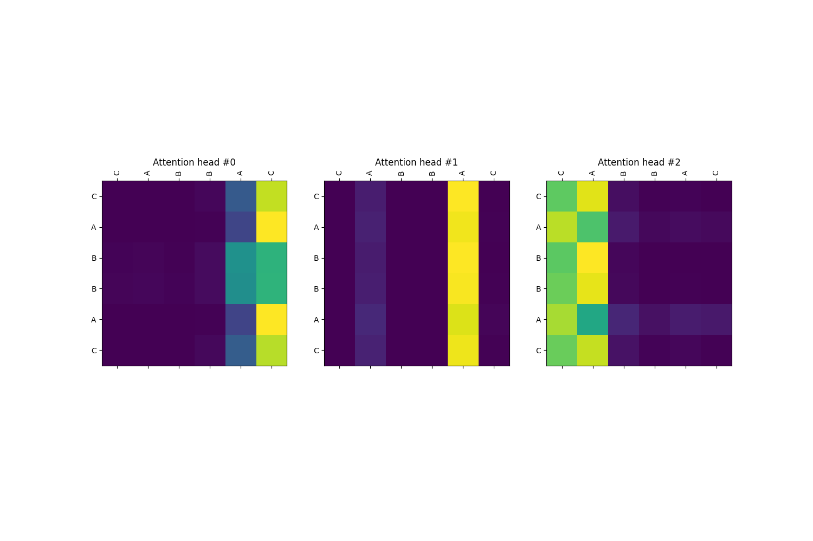

# Palindrome Classifier
 
This is a simple experiment I made to help me familiarize with how the
self-attention mechanism works in the Transformer neural network architecture and also
practice using it myself. I coded up a python generator object `gen_data()` to generate 
random sequences of letters that are classified as either a palindrome or not, which 
I combined with tf.data.Dataset.from_generator method to create a data pipeline for 
training the model. Here's some attention mappings I saved afterwards:

